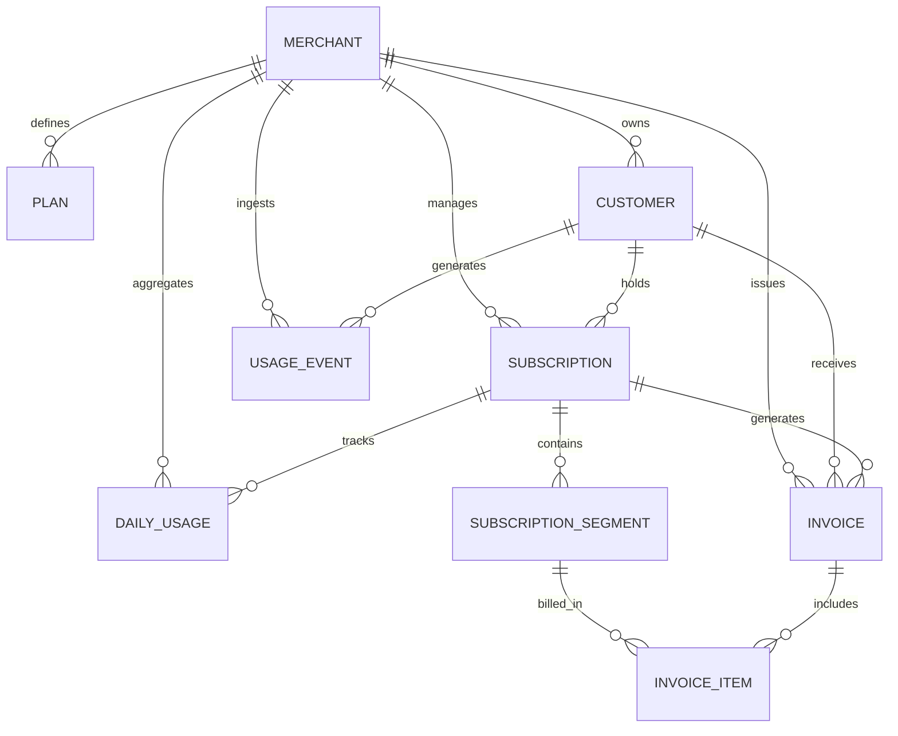

# Subscription Billing & Usage-Metering System

## Overview

This project is a multi-tenant SaaS Subscription Billing & Usage-Metering backend application built with Laravel. It is designed to handle multi-tenancy, plan subscriptions, metered usage event ingestion, usage aggregation, mid-cycle plan changes, and automated invoice processing.

## Current Architecture

The codebase is currently in the **Database Schema & Domain Layer** phase. The database migrations, Eloquent domain models, relationships, model factories, schema integrity tests, and 50L+ usage event scalability design have been established.

## Tech Stack

- **PHP**: `^8.2` (Detected runtime: `PHP 8.2.12`)
- **Framework**: Laravel `12.x` (Detected version: `12.69.2`)
- **Database**: SQLite (default for local development), with MySQL/PostgreSQL support
- **Queue / Cache**: Database / Redis driver configuration via environment variables
- **Testing**: PHPUnit `11.x`
- **Code Styling**: Laravel Pint `1.24`

## Local Setup

Follow these steps to set up the project locally:

1. **Clone the repository & install dependencies**:
   ```bash
   composer install
   ```

2. **Configure Environment**:
   ```bash
   cp .env.example .env
   ```

3. **Generate Application Key**:
   ```bash
   php artisan key:generate
   ```

4. **Run Database Migrations**:
   ```bash
   php artisan migrate
   ```

5. **Start Local Development Server**:
   ```bash
   php artisan serve
   ```

6. **Start Local Queue Worker**:
   ```bash
   php artisan queue:work
   ```

7. **Run Test Suite**:
   ```bash
   php artisan test
   ```

8. **Code Formatting (Pint)**:
   ```bash
   vendor/bin/pint
   ```

## Environment

All secrets and environment-specific parameters are supplied via the `.env` file and are excluded from Git version control. Refer to `.env.example` for all configurable environment variables.

## Database Architecture

The core domain schema consists of 9 core normalized tables supporting multi-tenancy, plan management, usage metering, mid-cycle subscription changes, and invoicing:

1. **`merchants`**: Represents SaaS tenants owning all tenant-isolated data.
2. **`plans`**: Defines pricing tiers (base price, included usage, overage rates per unit).
3. **`customers`**: Represents end customers belonging to a specific merchant.
4. **`subscriptions`**: Tracks active and historical customer plan subscriptions.
5. **`subscription_segments`**: Handles mid-cycle plan upgrades/downgrades with immutable pricing snapshots.
6. **`usage_events`**: High-write event table with database-enforced idempotency key uniqueness per merchant.
7. **`daily_usages`**: Pre-aggregated daily usage totals for rapid billing calculations and dashboard queries.
8. **`invoices`**: Billing cycle invoice headers.
9. **`invoice_items`**: Detailed line items (base subscription charges, usage overages, segment proration).

## Entity Relationships

```
Merchant
├── Plans
├── Customers
│     └── Subscriptions
│           ├── Subscription Segments
│           ├── Usage Events
│           ├── Daily Usages
│           └── Invoices
│                 └── Invoice Items
```



## Index Strategy

Targeted composite indexes are defined to optimize high-cardinality lookups and range queries:

- **`usage_events`**:
  - `UNIQUE (merchant_id, idempotency_key)`: Provides immediate O(1) B-tree lookup for idempotency checks during event ingestion.
  - `INDEX (merchant_id, occurred_at)`: Optimizes tenant-scoped temporal queries and aggregation jobs.
  - `INDEX (merchant_id, customer_id, occurred_at)`: Optimizes customer-specific usage history range queries.
  - `INDEX (subscription_id, occurred_at)`: Optimizes subscription-scoped event lookups.
- **`daily_usages`**:
  - `UNIQUE (subscription_id, subscription_segment_id, usage_date)`: Guarantees aggregate record uniqueness per segment and date.
  - `INDEX (merchant_id, usage_date)`: Facilitates tenant dashboard queries.
  - `INDEX (merchant_id, customer_id, usage_date)`: Accelerates customer billing aggregation over monthly boundaries.
- **`subscription_segments`**:
  - `INDEX (subscription_id, starts_at, ends_at)`: Optimizes point-in-time segment resolution for event pricing.
- **`invoices`**:
  - `INDEX (merchant_id, period_starts_at, period_ends_at)`: Speeds up merchant invoice reporting and period lookups.

## Idempotency Strategy

High-volume API event ingestion uses a database-enforced compound unique index `UNIQUE (merchant_id, idempotency_key)` on the `usage_events` table. 

- **Why merchant-scoped?** Idempotency keys generated by external systems (e.g. `evt_abc123`) might collide across different tenants. Scoping by `merchant_id` allows tenant isolation while ensuring absolute per-merchant idempotency.
- **Database-Level Guarantee**: Re-transmitted requests causing a duplicate insert trigger a database `QueryException` (duplicate entry violation), preventing duplicate billing events regardless of concurrent worker execution.

## Multi-Tenancy Strategy

Every tenant-owned model includes a direct `merchant_id` foreign key. 
- **Query Isolation**: All database queries filter explicitly by `merchant_id` to prevent cross-tenant data leaks.
- **Foreign Key Restraints**: All tenant-owned child tables use `restrictOnDelete` on `merchant_id` to preserve financial auditability and prevent accidental loss of historical billing records.

## Historical Pricing Strategy

When a customer upgrades or downgrades a plan mid-billing-cycle, the system creates a new entry in `subscription_segments` with explicit timestamp boundaries (`starts_at`, `ends_at`) and **snapshot pricing fields**:
- `snapshot_base_price`
- `snapshot_included_usage_units`
- `snapshot_overage_rate_per_unit`

**Why Pricing Snapshots?**
If a plan's pricing is modified in the future, previously completed billing cycles and historical subscription segments remain deterministic and immune to retroactively altered prices.

## Scaling to 50L+ Usage Events

For enterprise SaaS workloads generating 50,000,000+ usage event records (50L+ rows), the architecture employs the following scaling strategy:

1. **Composite B-Tree Indexes**: Targeted multi-column indexes on `(merchant_id, occurred_at)` and `(merchant_id, idempotency_key)` maintain sub-millisecond lookups even as table cardinalities scale.
2. **Avoid Repeated Scans of Raw Events**: Raw event rows are ingested asynchronously. Queries for billing, invoicing, and dashboards read exclusively from pre-aggregated `daily_usages` tables rather than scanning millions of raw rows.
3. **Pre-Aggregation**: Asynchronous background workers calculate daily aggregate usage totals and store them in `daily_usages`, reducing billing query complexity from $O(N_{\text{events}})$ to $O(N_{\text{days}})$.
4. **Chunked Processing**: Batch processing jobs pull raw events in cursor-paginated chunks (e.g., `chunkById(1000)`) to maintain bounded memory consumption during aggregation.
5. **Queue-Based Decoupling**: Usage ingestion endpoints write events directly to queue buffers or fast database inserts, decoupling synchronous API responses from heavy aggregation workloads.
6. **Database Growth & Storage Footprint**: Raw events table size is controlled by indexing only high-cardinality columns and using fixed-size integers (`unsignedBigInteger`) for metric counts.
7. **Time-Based Table Partitioning**:
   - **Strategy**: In PostgreSQL/MySQL production deployments, `usage_events` is partitioned by month using `RANGE (occurred_at)` (e.g. `usage_events_2026_09`).
   - **Benefits**: Queries for current billing cycles scan only the active monthly partition. Dropping expired partitions (`DROP TABLE usage_events_2025_01`) instantly frees disk space without costly `DELETE` operations or index fragmentation.
8. **Retention & Archival Strategy**: Raw events older than 90 days are archived to cold storage (e.g. S3 / Parquet files) or a data lake, while retaining `daily_usages` permanently for audit history.
9. **Read/Write Workload Separation**: Read-heavy billing and dashboard queries utilize read-replicas, isolating write transaction throughput on the primary database node.
10. **Dedicated Analytics Store (Future Expansion)**: At 500M+ event scales, raw ingestion can seamlessly offload to a dedicated columnar time-series database (e.g. ClickHouse or TimescaleDB) while keeping Eloquent models for application domain logic.

## Architecture Direction

The application follows a clean separation of concerns using standard Laravel conventions:

- **API Layer**: Controller routes prefixed under `/api/v1` handling HTTP requests.
- **Validation**: Form Request classes managing payload validation rules.
- **Actions / Services**: Encapsulating discrete domain actions and application service workflows.
- **Domain Logic**: Business logic and domain entities decoupled from delivery mechanisms.
- **Persistence**: Eloquent Models and database migrations.
- **Queued Processing**: Asynchronous workers for chunked event aggregation and background processing.

## Assumptions / Trade-offs

- **Foundation Scope**: Non-business functionality is intentionally deferred to subsequent phase implementations to maintain focus on foundation quality.
- **Response Convention**: Standardized JSON responses for API endpoints (`success`, `data`, `message` for success; `success`, `message`, `errors` for errors).
- **Exception Handling**: API exception responses sanitize uncaught server exceptions in production mode to prevent information disclosure.
