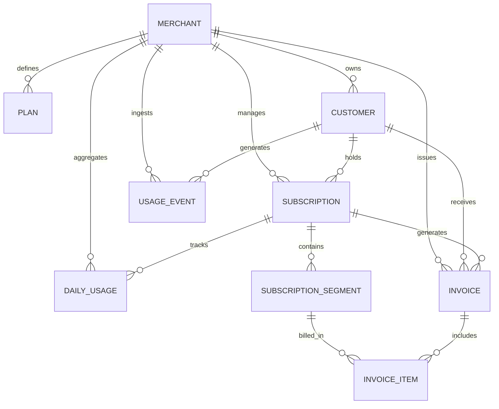

# Subscription Billing & Usage-Metering System

## Overview

This project is a multi-tenant SaaS Subscription Billing & Usage-Metering backend application built with Laravel. It is designed to handle multi-tenancy, plan subscriptions, metered usage event ingestion, usage aggregation, mid-cycle plan changes, and automated invoice processing.

## Current Architecture

The codebase is currently in the **Cache & Merchant Dashboard** phase. The database migrations, Eloquent domain models, relationships, model factories, schema integrity tests, 50L+ usage event scalability design, high-throughput `POST /api/v1/usage` API, asynchronous `usage:aggregate` infrastructure, deterministic `BillingService` engine, `PlanPricingService` cache, and tenant-isolated `GET /api/v1/merchants/{id}/dashboard` API have been established.

## Tech Stack

- **PHP**: `^8.2` (Detected runtime: `PHP 8.2.12`)
- **Framework**: Laravel `12.x` (Detected version: `12.69.2`)
- **Database**: SQLite (default for local development), with MySQL/PostgreSQL support
- **Queue / Cache**: Database / Redis driver configuration via environment variables
- **Testing**: PHPUnit `11.x`
- **Code Styling**: Laravel Pint `1.24`

## Local Setup

Follow these steps to set up the project locally:

1. **Clone the repository & install dependencies**:
   ```bash
   composer install
   ```

2. **Configure Environment**:
   ```bash
   cp .env.example .env
   ```

3. **Generate Application Key**:
   ```bash
   php artisan key:generate
   ```

4. **Run Database Migrations**:
   ```bash
   php artisan migrate
   ```

5. **Start Local Development Server**:
   ```bash
   php artisan serve
   ```

6. **Start Local Queue Worker**:
   ```bash
   php artisan queue:work
   ```

7. **Run Test Suite**:
   ```bash
   php artisan test
   ```

8. **Code Formatting (Pint)**:
   ```bash
   vendor/bin/pint
   ```

## Environment

All secrets and environment-specific parameters are supplied via the `.env` file and are excluded from Git version control. Refer to `.env.example` for all configurable environment variables.

## Usage API

### Endpoint: `POST /api/v1/usage`

The usage ingestion endpoint records metered events with strict validation, tenant scoping, and idempotency guarantees.

#### Example Request Payload:
```json
{
  "merchant_id": 1,
  "customer_id": 101,
  "occurred_at": "2026-09-14T10:30:00Z",
  "units": 5,
  "idempotency_key": "evt_abc123"
}
```

#### Example Success Response (HTTP 201 Created):
```json
{
  "success": true,
  "data": {
    "id": 1,
    "merchant_id": 1,
    "customer_id": 101,
    "subscription_id": 5,
    "subscription_segment_id": 12,
    "units": 5,
    "idempotency_key": "evt_abc123",
    "occurred_at": "2026-09-14T10:30:00Z",
    "created_at": "2026-09-14T10:30:01Z"
  },
  "message": "Usage recorded successfully."
}
```

#### Validation Rules:
- `merchant_id`: Required, integer, must exist in `merchants` table.
- `customer_id`: Required, integer, must exist in `customers` table AND belong to the specified `merchant_id`. Cross-tenant customer IDs are rejected with **HTTP 422**.
- `occurred_at`: Required, valid ISO 8601 date string.
- `units`: Required, positive integer ($\ge 1$). Zero or negative values are rejected with **HTTP 422**.
- `idempotency_key`: Required, string ($\le 255$ chars).

---

## Idempotency Strategy

High-volume API event ingestion uses a database-enforced compound unique index `UNIQUE (merchant_id, idempotency_key)` on the `usage_events` table. 

- **Why merchant-scoped?** Idempotency keys generated by external systems (e.g. `evt_abc123`) might collide across different tenants. Scoping by `merchant_id` allows tenant isolation while ensuring absolute per-merchant idempotency.
- **Retry Response (HTTP 200 OK)**: Re-transmitting an identical usage event payload returns **HTTP 200 OK** containing the original `UsageEvent` record without inserting duplicate database rows.
- **Payload Conflict Detection (HTTP 409 Conflict)**: Reusing an `idempotency_key` with conflicting payload data (e.g. different units or customer) returns **HTTP 409 Conflict**.
- **Concurrency & Race Condition Handling**: If concurrent HTTP workers attempt to insert the same `(merchant_id, idempotency_key)` simultaneously, the database `UNIQUE` constraint raises a `QueryException`, which is caught and gracefully evaluated into an idempotent response.

---

## Usage Ingestion Scalability & Rate Limiting

- **Lightweight Execution Path**: The `POST /api/v1/usage` HTTP path is strictly lightweight. It performs payload validation, active subscription/segment resolution, and database insertion. Heavy operations (billing calculations, overage math, daily aggregates) are excluded from the synchronous request path.
- **Rate Limiting**: Throttled by `throttle:usage` middleware (configured in `AppServiceProvider`). Requests are limited to 600 requests/minute per merchant (`merchant_id`). Exceeding the rate limit returns **HTTP 429 Too Many Requests**.

---

## Usage Aggregation Architecture

The usage aggregation infrastructure processes raw `usage_events` records asynchronously into `daily_usages` records.

```
usage_events ──> Queue / Command ──> AggregateDailyUsage Job ──> UsageAggregationService ──> daily_usages (upsert)
```

### Key Components:
- **`UsageAggregationService`** ([app/Services/UsageAggregationService.php](file:///d:/subscription-billing-usage-metering/app/Services/UsageAggregationService.php)): Core domain service executing primary-key chunking and exact recomputation.
- **`AggregateDailyUsage`** ([app/Jobs/AggregateDailyUsage.php](file:///d:/subscription-billing-usage-metering/app/Jobs/AggregateDailyUsage.php)): Queueable job with retry policies (`tries = 3`, `backoff = [10, 30, 60]`, `timeout = 120`).
- **`usage:aggregate` Command** ([app/Console/Commands/AggregateUsageCommand.php](file:///d:/subscription-billing-usage-metering/app/Console/Commands/AggregateUsageCommand.php)): Artisan CLI command for manual administration or scheduled execution (`php artisan usage:aggregate --from=2026-09-01 --to=2026-09-14 --queue`).

---

### Chunking Strategy (`lazyById` vs `OFFSET`)

Processing tens of millions of raw usage events requires strict primary-key chunking:
- **Why `lazyById` / `chunkById`?** Standard offset-based pagination (`LIMIT 1000 OFFSET 5000000`) forces database engines to scan 5,000,000 index entries before returning the next 1,000 rows, resulting in severe $O(N^2)$ performance degradation. Primary-key chunking uses `WHERE id > last_seen_id ORDER BY id ASC LIMIT 1000`, leveraging the primary key index for $O(1)$ page traversal regardless of dataset depth.
- **Memory Footprint**: Memory usage remains constant ($\le 10\text{MB}$) regardless of whether 10,000 or 50,000,000 rows are processed.

---

### Idempotent Aggregation & Recomputation

- **Exact Recomputation**: Instead of incrementing `total_usage_units` via `UPDATE daily_usages SET total_usage_units = total_usage_units + X`, `UsageAggregationService` calculates `SUM(usage_units)` for each `(subscription_id, subscription_segment_id, usage_date)` tuple present in the window and updates the record via `updateOrCreate`.
- **Retry Safety**: Executing the aggregation job 10 times produces the exact same `daily_usage` totals without double-counting.
- **Database Uniqueness**: Guaranteed by unique compound key `UNIQUE (subscription_id, subscription_segment_id, usage_date)`.

---

### Late Arriving Events

Usage events arriving out of chronological order (e.g. Sept 10 event arriving on Sept 14) are handled seamlessly:
1. The late event is ingested safely into `usage_events` with its historical `occurred_at` timestamp.
2. During the next aggregation run covering that window, `UsageAggregationService` identifies the affected `(subscription_id, subscription_segment_id, usage_date)` key, re-calculates the complete `SUM(usage_units)` for that date, and updates `daily_usages` to reflect the corrected historical aggregate.

---

### Subscription Segment Isolation for Mid-Cycle Plan Changes

Daily aggregates preserve the `subscription_segment_id` associated with each usage event. If a customer upgrades plans mid-cycle, usage incurred under Segment A and Segment B on their respective dates remain separated in `daily_usages`, allowing future billing calculation to apply the exact snapshot pricing of each segment correctly.

---

## Core Billing Engine Architecture

The billing engine generates immutable `invoices` and `invoice_items` at cycle end based on pre-aggregated `daily_usages` and historical `subscription_segments`.

```
Subscription Cycle End ──> Command / Queue ──> ProcessSubscriptionBilling Job ──> BillingService ──> Invoice + Items
```

### Key Components:
- **`BillingService`** ([app/Services/BillingService.php](file:///d:/subscription-billing-usage-metering/app/Services/BillingService.php)): Isolated domain service managing proration, included allowance, overage, and transactional invoice generation.
- **`ProcessSubscriptionBilling`** ([app/Jobs/ProcessSubscriptionBilling.php](file:///d:/subscription-billing-usage-metering/app/Jobs/ProcessSubscriptionBilling.php)): Queueable job (`$tries = 3`, `$backoff = [10, 30, 60]`).
- **`billing:generate` Command** ([app/Console/Commands/GenerateInvoicesCommand.php](file:///d:/subscription-billing-usage-metering/app/Console/Commands/GenerateInvoicesCommand.php)): Artisan CLI command for triggering cycle-end invoice generation (`php artisan billing:generate --date=2026-09-30 --queue`).

---

### Proration Formula

Proration uses deterministic calendar-day calculations over exact cycle bounds:

$$\text{Daily Base Rate} = \frac{\text{snapshot\_base\_price}}{\text{total\_cycle\_days}}$$

$$\text{Prorated Base Charge} = \text{round}(\text{Daily Base Rate} \times \text{segment\_active\_days}, 2)$$

- **Full Cycle**: If a segment is active for the full cycle ($\text{segment\_active\_days} = \text{total\_cycle\_days}$), the prorated base charge equals `snapshot_base_price` exactly.
- **Partial Cycle**: If active for part of the cycle (e.g. 15 days out of 30), base price is prorated proportionally.

---

### Included Allowance & Overage Formula

To align with segment duration, included usage allowances are prorated per active segment:

$$\text{Prorated Included Allowance} = \left\lfloor \text{snapshot\_included\_units} \times \frac{\text{segment\_active\_days}}{\text{total\_cycle\_days}} \right\rfloor$$

$$\text{Billable Overage Units} = \max(0, \text{total\_segment\_usage} - \text{Prorated Included Allowance})$$

$$\text{Overage Charge Amount} = \text{round}(\text{Billable Overage Units} \times \text{snapshot\_overage\_rate}, 2)$$

---

### Segment-Based Billing (Upgrades & Downgrades)

When a customer upgrades or downgrades plans mid-cycle:
1. Each historical `SubscriptionSegment` active during the billing period is evaluated independently.
2. Segment A usage is billed against Segment A snapshot pricing and prorated allowance.
3. Segment B usage is billed against Segment B snapshot pricing and prorated allowance.
4. Total Invoice Amount = $\sum \text{Segment Base Charges} + \sum \text{Segment Overage Charges}$.

---

### Historical Pricing Snapshots

Billing calculations use `snapshot_base_price`, `snapshot_included_usage_units`, and `snapshot_overage_rate_per_unit` from `SubscriptionSegment` instead of reading live `Plan` pricing. Future edits to plan prices do not alter historical or past billing cycles.

---

### Monetary Precision & Rounding Strategy

- **Decimal Precision**: Base charges and overage amounts are rounded to 2 decimal places (`round(..., 2)`).
- **Subtotal & Total Consistency**: `invoice.subtotal` and `invoice.total` are computed as the exact sum of line items: $\text{Subtotal} = \text{Total} = \sum \text{item.amount}$.

---

### Billing Idempotency & Retry Safety

- **Database Uniqueness**: Guaranteed by compound index `UNIQUE (subscription_id, period_starts_at, period_ends_at)` on `invoices`.
- **Idempotent Retry**: Re-running `BillingService` or `billing:generate` for a cycle that has already been billed returns the existing `Invoice` record without creating duplicate invoices or line items.

---

## Pricing Cache & Invalidation Strategy

The application provides a dedicated plan pricing caching layer via [`PlanPricingService`](file:///d:/subscription-billing-usage-metering/app/Services/PlanPricingService.php).

- **Cache Key**: Predictable format `plan:{plan_id}:pricing`.
- **Cached Data**: Array containing `id`, `merchant_id`, `name`, `code`, `base_price`, `billing_cycle`, `included_usage_units`, `overage_rate_per_unit`, and `is_active`.
- **TTL**: 86400 seconds (24 hours).
- **Cache Invalidation**: Automatic via [`PlanObserver`](file:///d:/subscription-billing-usage-metering/app/Observers/PlanObserver.php) attached to the `Plan` model (`saved`, `updated`, `deleted` events trigger `Cache::forget("plan:{$plan->id}:pricing")`).
- **Database Fallback**: If the cache store is unavailable or on a cache miss, `PlanPricingService` falls back to direct database retrieval seamlessly without throwing application errors.
- **Historical Billing Separation**: Historical invoice generation uses `SubscriptionSegment` pricing snapshots. The pricing cache is strictly an optimization for current plan and pricing lookups.

---

## Merchant Analytics Dashboard

The Merchant Dashboard endpoint `GET /api/v1/merchants/{id}/dashboard` ([MerchantDashboardController.php](file:///d:/subscription-billing-usage-metering/app/Http/Controllers/Api/MerchantDashboardController.php)) provides tenant-isolated business analytics.

```json
{
  "success": true,
  "data": {
    "top_customers_by_usage": [
      {
        "customer_id": 101,
        "name": "Acme Corp",
        "email": "contact@acme.com",
        "total_usage_units": 15000
      }
    ],
    "projected_overage_revenue": 1250.50,
    "churn_risk_customers": [
      {
        "customer_id": 202,
        "name": "Beta Inc",
        "email": "billing@beta.com",
        "current_month_usage": 400,
        "previous_month_usage": 1000,
        "drop_percentage": 60.0
      }
    ]
  },
  "message": "Dashboard retrieved successfully."
}
```

### Dashboard Analytics Metrics:

1. **Top 5 Customers by Usage This Month**:
   - Queries `daily_usages` pre-aggregated table for the current calendar month.
   - SQL `GROUP BY customer_id ORDER BY SUM(total_usage_units) DESC LIMIT 5`.
2. **Projected Overage Revenue for Current Cycle**:
   - Analyzes active subscriptions for the merchant in the current billing cycle.
   - Calculates elapsed cycle days ($D_{\text{elapsed}}$) vs total cycle days ($D_{\text{total}}$).
   - Projects total cycle usage: $U_{\text{projected}} = \left\lfloor \frac{\text{Accumulated Usage}}{D_{\text{elapsed}}} \times D_{\text{total}} \right\rfloor$.
   - Calculates projected overage units beyond included plan allowance and applies segment overage pricing rates.
3. **Churn Risk Customers (>50% Usage Drop Month-over-Month)**:
   - Compares total `daily_usages` in current month vs previous calendar month per customer.
   - Condition: $\text{previous\_usage} > 0$ and $\text{current\_usage} < \text{previous\_usage} \times 0.50$ (drop strictly greater than 50%).
   - Returns customer details with exact `drop_percentage`.

---

## Database Architecture

The core domain schema consists of 9 core normalized tables supporting multi-tenancy, plan management, usage metering, mid-cycle subscription changes, and invoicing:

1. **`merchants`**: Represents SaaS tenants owning all tenant-isolated data.
2. **`plans`**: Defines pricing tiers (base price, included usage, overage rates per unit).
3. **`customers`**: Represents end customers belonging to a specific merchant.
4. **`subscriptions`**: Tracks active and historical customer plan subscriptions.
5. **`subscription_segments`**: Handles mid-cycle plan upgrades/downgrades with immutable pricing snapshots.
6. **`usage_events`**: High-write event table with database-enforced idempotency key uniqueness per merchant.
7. **`daily_usages`**: Pre-aggregated daily usage totals for rapid billing calculations and dashboard queries.
8. **`invoices`**: Billing cycle invoice headers.
9. **`invoice_items`**: Detailed line items (base subscription charges, usage overages, segment proration).

## Entity Relationships

```
Merchant
├── Plans
├── Customers
│     └── Subscriptions
│           ├── Subscription Segments
│           ├── Usage Events
│           ├── Daily Usages
│           └── Invoices
│                 └── Invoice Items
```



## Index Strategy

Targeted composite indexes are defined to optimize high-cardinality lookups and range queries:

- **`usage_events`**:
  - `UNIQUE (merchant_id, idempotency_key)`: Provides immediate O(1) B-tree lookup for idempotency checks during event ingestion.
  - `INDEX (merchant_id, occurred_at)`: Optimizes tenant-scoped temporal queries and aggregation jobs.
  - `INDEX (merchant_id, customer_id, occurred_at)`: Optimizes customer-specific usage history range queries.
  - `INDEX (subscription_id, occurred_at)`: Optimizes subscription-scoped event lookups.
- **`daily_usages`**:
  - `UNIQUE (subscription_id, subscription_segment_id, usage_date)`: Guarantees aggregate record uniqueness per segment and date.
  - `INDEX (merchant_id, usage_date)`: Facilitates tenant dashboard queries.
  - `INDEX (merchant_id, customer_id, usage_date)`: Accelerates customer billing aggregation over monthly boundaries.
- **`subscription_segments`**:
  - `INDEX (subscription_id, starts_at, ends_at)`: Optimizes point-in-time segment resolution for event pricing.
- **`invoices`**:
  - `INDEX (merchant_id, period_starts_at, period_ends_at)`: Speeds up merchant invoice reporting and period lookups.

## Multi-Tenancy Strategy

Every tenant-owned model includes a direct `merchant_id` foreign key. 
- **Query Isolation**: All database queries filter explicitly by `merchant_id` to prevent cross-tenant data leaks.
- **Foreign Key Restraints**: All tenant-owned child tables use `restrictOnDelete` on `merchant_id` to preserve financial auditability and prevent accidental loss of historical billing records.

## Historical Pricing Strategy

When a customer upgrades or downgrades a plan mid-billing-cycle, the system creates a new entry in `subscription_segments` with explicit timestamp boundaries (`starts_at`, `ends_at`) and **snapshot pricing fields**:
- `snapshot_base_price`
- `snapshot_included_usage_units`
- `snapshot_overage_rate_per_unit`

**Why Pricing Snapshots?**
If a plan's pricing is modified in the future, previously completed billing cycles and historical subscription segments remain deterministic and immune to retroactively altered prices.

## Scaling to 50L+ Usage Events

For enterprise SaaS workloads generating 50,000,000+ usage event records (50L+ rows), the architecture employs the following scaling strategy:

1. **Composite B-Tree Indexes**: Targeted multi-column indexes on `(merchant_id, occurred_at)` and `(merchant_id, idempotency_key)` maintain sub-millisecond lookups even as table cardinalities scale.
2. **Avoid Repeated Scans of Raw Events**: Raw event rows are ingested asynchronously. Queries for billing, invoicing, and dashboards read exclusively from pre-aggregated `daily_usages` tables rather than scanning millions of raw rows.
3. **Pre-Aggregation**: Asynchronous background workers calculate daily aggregate usage totals and store them in `daily_usages`, reducing billing query complexity from $O(N_{\text{events}})$ to $O(N_{\text{days}})$.
4. **Chunked Processing**: Batch processing jobs pull raw events in cursor-paginated chunks (e.g., `chunkById(1000)`) to maintain bounded memory consumption during aggregation.
5. **Queue-Based Decoupling**: Usage ingestion endpoints write events directly to queue buffers or fast database inserts, decoupling synchronous API responses from heavy aggregation workloads.
6. **Database Growth & Storage Footprint**: Raw events table size is controlled by indexing only high-cardinality columns and using fixed-size integers (`unsignedBigInteger`) for metric counts.
7. **Time-Based Table Partitioning**:
   - **Strategy**: In PostgreSQL/MySQL production deployments, `usage_events` is partitioned by month using `RANGE (occurred_at)` (e.g. `usage_events_2026_09`).
   - **Benefits**: Queries for current billing cycles scan only the active monthly partition. Dropping expired partitions (`DROP TABLE usage_events_2025_01`) instantly frees disk space without costly `DELETE` operations or index fragmentation.
8. **Retention & Archival Strategy**: Raw events older than 90 days are archived to cold storage (e.g. S3 / Parquet files) or a data lake, while retaining `daily_usages` permanently for audit history.
9. **Read/Write Workload Separation**: Read-heavy billing and dashboard queries utilize read-replicas, isolating write transaction throughput on the primary database node.
10. **Dedicated Analytics Store (Future Expansion)**: At 500M+ event scales, raw ingestion can seamlessly offload to a dedicated columnar time-series database (e.g. ClickHouse or TimescaleDB) while keeping Eloquent models for application domain logic.

## Architecture Direction

The application follows a clean separation of concerns using standard Laravel conventions:

- **API Layer**: Controller routes prefixed under `/api/v1` handling HTTP requests.
- **Validation**: Form Request classes managing payload validation rules.
- **Actions / Services**: Encapsulating discrete domain actions and application service workflows.
- **Domain Logic**: Business logic and domain entities decoupled from delivery mechanisms.
- **Persistence**: Eloquent Models and database migrations.
- **Queued Processing**: Asynchronous workers for chunked event aggregation and background processing.

## Assumptions / Trade-offs

- **Foundation Scope**: Non-business functionality is intentionally deferred to subsequent phase implementations to maintain focus on foundation quality.
- **Response Convention**: Standardized JSON responses for API endpoints (`success`, `data`, `message` for success; `success`, `message`, `errors` for errors).
- **Exception Handling**: API exception responses sanitize uncaught server exceptions in production mode to prevent information disclosure.
